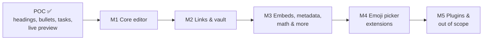

# mdedit: Project Plan

mdedit is a terminal Markdown editor with Obsidian-style Live Preview: every
line is shown formatted except the one being edited. It is written in Rust
with ratatui.

**Sources:**
- `requirements/obsidian_features.md`: the feature list, with the milestone
  of each feature
- `requirements/obsidian_parity_requirements.md`: R-xx
- `requirements/file_handling_requirements.md`: F-xx
- `requirements/emoji_picker_requirements.md`: EP-xx (T-14)
- `requirements/poc_requirements.md`: the original vision

**Status:**
- ✅ done
- 🟡 partial
- ⬜ open

**Effort:**
- **S:** single line
- **M:** needs block-level parsing
- **L:** needs a vault index or terminal graphics

---

## 1. Milestone overview

| Milestone | Theme | Items | ✅ | 🟡 | ⬜ | Effort S / M / L |
|-----------|-------|------:|---:|---:|---:|------------------|
| **M1** | Core editor: formatting, lists, blocks, editing behaviors, and file handling | 52 + infra | 52 | 0 | 0 | 30 / 22 / 0 |
| **M2** | Links (no vault: relative to the current file) | 10 | 10 | 0 | 0 | 8 / 1 / 1 |
| **M3** | Embeds, metadata, math, diagrams, footnotes, comments, HTML, task types | 24 | 7 | 1 | 16 | 9 / 10 / 5 |
| **M4** | Emoji picker extensions (EP-06 … EP-12) | 6 EP items | 1 | 0 | 5 | – |
| **M5** | Community plugin syntax, and the out-of-scope app features | 2 | 0 | 1 | 1 | 1 / 0 / 1 |

| *Wrapper* | Vault features, for the future wrapper project (section 6) | 9 | – | – | – | not planned in mdedit |

Item counts are feature rows in `obsidian_features.md`. M1 also contains
the infrastructure and file-handling work listed in section 2.

### Next up

In order:

1. ✅ **Complete terminal help (`mdedit -h`)** (1.3.0): document everything, not
   only the command-line options. That means every command-line option with
   its values, every key (editing, selection, search and replace, undo,
   folding, links, dialogs), every `config.toml` setting with its values and
   default, and the config file's location. Keep it in sync with the README
   (a test should check that each option, key and setting in the README
   also appears in `--help`).
2. ✅ **M2 links** (K-03 … K-08, 1.4.0 … 1.8.0) and following a
   `[[this-note#Heading]]` link within the document (1.8.1). M2 is
   complete.

---

## 2. Milestone 1: Core editor

**Goal:** a daily-usable Markdown editor for a single file. It should render
every common Markdown construct correctly, save safely, and feel like
Obsidian when editing.

### 2.1 Foundation (do first; everything else depends on it)

| Ref | Work item | Status |
|-----|-----------|--------|
| R-04 | Whole-document block parser. Needed for code blocks, tables, callout bodies and folding | ✅ `src/blocks.rs` (hand-written scanner; tree-sitter deferred, see R-04) |
| R-03 / V-08 | Soft wrap with hanging indent: map between source lines and screen rows, and move the cursor by screen row | ✅ `src/wrap.rs` |
| F-01 | Ctrl+S saves straight away if the document has a file, otherwise opens Save As | ✅ |
| F-02 | Ctrl+Shift+S Save As popup: file name and folder picker | ✅ Ctrl+Shift+S or Ctrl+Alt+S; browser shared with Open (`src/files.rs`) |
| F-03 | Ctrl+X exits and asks Yes/No/Cancel if there are unsaved changes (replaces Ctrl+Q) | ✅ |
| F-04 | Ctrl+O opens a file picker; if there are unsaved changes it first asks to save or discard them | ✅ |
| F-07 | Safe save: atomic replace, keeps line endings, final newline, permissions and symlinks | ✅ 0.50.2 |
| R-18 | Emoji handling: move the cursor by grapheme cluster, and make the scripted Konsole test repeatable | ✅ `tests/konsole.rs` |

### 2.2 Text formatting (T-01 … T-14)

- ✅ **T-14 emoji picker (Ctrl+E)**: search by name or shortcode with fuzzy
  ranking, arrow keys through the grid, Enter inserts at the cursor
  (EP-01 … EP-05). The rest (recently used, skin tones, categories,
  preview, …) is in M4. See `requirements/emoji_picker_requirements.md`.
- ✅ T-01 headings (ATX) · T-02 headings (Setext) · T-03 bold · T-04 italic · T-05 bold + italic · T-06 strikethrough · T-07 highlight · T-08 inline code · T-09 backslash escapes · T-10 paragraphs / blank lines · T-11 line breaks · T-12 horizontal rule · T-13 emoji / Unicode
- Related: ✅ R-17 heading spacing · ✅ R-16 heading size (DEC double-size lines where supported: Konsole, xterm, WezTerm)

### 2.3 Lists and tasks (L-01 … L-08)

- ✅ L-01 unordered list · L-02 ordered list · L-03 nested lists · L-04 task list · L-05 alternate checkbox states · L-06 ordered task list · L-07 paragraphs inside list items · L-08 list renumbering
- ✅ L-09 task types and L-10 custom task states (planned for M3, done through L-05)
- Related: ✅ R-07 configurable done style (`done_style` in `~/.config/mdedit/config.toml`)

### 2.4 Blocks (B-01 … B-13)

- ✅ B-01 blockquote · B-02 nested blockquote · B-03 callout · B-04 callout types · B-05 foldable callout · B-06 nested callout · B-07 custom callout types · B-08 fenced code block · B-09 syntax highlighting · B-10 indented code block · B-11 tables · B-12 table column alignment · B-13 wiki link inside table

### 2.5 Live Preview editing behaviors (V-01 … V-13)

- ✅ V-01 show raw syntax under cursor (the whole line, by design) · V-02 list / task continuation · V-03 indent / outdent · V-06 fold headings · V-07 fold lists · V-08 soft wrap · V-11 toggle checkbox · V-13 source mode · V-14 task type continues on Enter · V-15 page Up / Page Down · V-16 search · V-17 find and replace · V-18 undo / redo · V-05 wrap selection · V-09 paste URL over selection · V-19 text selection · V-04 auto-pair · V-20 highlight search matches (2.1.0)

### 2.6 Suggested order inside M1

1. **Foundation:** R-04 block parser, then R-03 soft wrap. F-01 to F-04 file
   handling can be built in parallel.
2. **Quick inline wins (all S):** T-03 to T-09 and L-02/L-06.
3. **Blocks on the new parser:** B-08/B-09 code, B-11/B-12 tables, callout
   bodies and nesting (B-02, B-05, B-06).
4. **Editing behaviors:** V-04, V-05 (needs text selection), V-06/V-07
   folding, V-12/V-13 view modes, V-09.

### 2.7 Done when

**✅ M1 complete in 1.0.0 (2026-09-27).** The scripted Konsole test is
still to be re-run by hand (`cargo test --test konsole -- --ignored`).

- Every note in `example_mds/` renders with no raw syntax visible away from
  the cursor (except syntax that belongs to M2 or later).
- Open, Save, Save As and Exit work as F-01 to F-04 describe, and no path can lose
  data silently.
- Scrolling and editing in Konsole leave no rendering artifacts (a scripted
  Konsole test passes).

---

## 3. Milestone 2: Links

**Goal:** every kind of link shows correctly, and a link to another Markdown
file can be followed. mdedit has **no vault**: links are resolved relative
to the current file's folder.

- ✅ K-01 wiki link · K-02 alias · K-09 bare URL
- ✅ K-03 link to heading · K-04 link to block (shown as `Note › Heading`, 1.4.0)
- ✅ K-05 block IDs (dimmed, 1.5.0)
- ✅ K-06 Markdown links (1.6.0)
- ✅ K-07 reference links (1.7.0)
- ✅ K-08 autolinks (1.8.0)
- Dropped: K-10 `obsidian://` URIs (not needed in a single-file editor)
- ✅ K-12 follow link: Ctrl+Enter (or Alt+Enter) opens the linked file (F-05, done early in 0.38.0)
- Related: R-10 (wiki links), R-11 (clickable URLs via OSC 8)

**Done when:** every link in the example notes is shown correctly, and a
link to a Markdown file next to the note can be followed.

**✅ M2 complete in 1.8.1 (2026-09-28).**

---

## 4. Milestone 3: Embeds, metadata, math and diagrams

**Goal:** show the rest of Obsidian's syntax in the terminal: content from
other notes and files, note properties, and technical notation.

- **Embeds (E-04 … E-07):** ✅ E-04 images and ✅ E-05 image size (1.2.0:
  `ratatui-image` with kitty, sixel, iTerm2 or half blocks, chosen by
  asking the terminal, or by `images = …` in `config.toml`); ⬜ audio/video
  and PDF (placeholders). Embedding other
  notes and sections by relative path (E-01, E-02) are done (0.42.0);
  block embeds (E-03) and queries (E-08, E-09) are in the wrapper project.
- **Metadata (P-01 … P-06):** ✅ P-05 inline tags · 🟡 P-01 frontmatter · ⬜
  property types, special properties, collapsing properties, tags in
  frontmatter. Related: R-05, R-12.
- **Math, diagrams, footnotes, comments, HTML (X-01 … X-10):** LaTeX shown
  as Unicode, Mermaid, footnotes, `%%comments%%`, inline/block HTML.
- ✅ **Task types (L-09, L-10):** done through L-05's glyphs: in progress
  `- [/]` ◐, forwarded `- [>]` ➜ (the Obsidian convention), cancelled /
  dropped `- [-]` ☒, important / priority `- [!]` ⚑. A task state is a
  single character: `[?]` shows as `?`, any other character as `[c]`; a
  word like `- [doing]` is not a task state. The type is typed in raw
  mode, and Enter continues it (V-14).

**Done when:** a note with images, math and a properties block is readable
in the terminal, and embeds show their content or a clear placeholder.

---

## 5. Milestone 4: Emoji picker extensions

**Goal:** the rest of the Obsidian emoji-toolbar experience, on top of the
M1 picker (T-14, EP-01 … EP-05). Spec: `requirements/emoji_picker_requirements.md`.

- ✅ EP-06 recently used emoji first, remembered between sessions (done early, 0.11.0)
- ⬜ EP-07 skin tones (Konsole draws them correctly; add them to the grid test)
- ⬜ EP-08 categories (headers in the grid, keys to jump between them)
- ⬜ EP-09 preview line (emoji, name and shortcode of the highlight)
- ⬜ EP-11 mouse click to insert
- ⬜ EP-12 `:shortcode:` autocomplete while typing, plus CLDR keywords for search
- ✗ EP-10 Twitter emoji artwork (not possible in a terminal)
- Also: flags and joined emoji in the picker (they need a display workaround first)

M4 can still take packaging and polish later (config file, themes,
installable releases).

---

## 6. Wrapper project (not part of mdedit)

**Decision (2026-09-27):** mdedit is a single-purpose app: it edits one
Markdown file and will **never** understand a vault. A separate, future
project will wrap mdedit, add the vault features, and use mdedit as its
editor in multiple tabs. These feature rows have the milestone **Wrapper**:

- K-11 unresolved-link styling · K-13 `[[` link autocomplete
- E-03 embedding another note's block (E-01 / E-02, notes and sections by
  relative path, are in mdedit since 0.42.0; the wrapper can add
  vault-wide lookup)
- E-08 search query embeds · E-09 Bases
- V-10 tag / property autocomplete
- C-02 Tasks query blocks (and Dataview queries, C-03)

**Separation (decided 2026-09-29):** mdedit is released on its own. It
contains **no wrapper code**: no tabs, no file list, no vault index, no demo
host. It only offers a generic embedding API that any host can use, and its
own binary is one such host.

**Embedding API** (✅ built in 2.0.0; see `documentation/embedding.md`):
- **State split:** app-wide `Shared` (config, terminal capabilities, image
  picker and cache, recent emoji), per-file `Document` (text, cursor, undo,
  selection, line endings), per-view `EditorView` (scroll, folds, source
  mode, search / replace / emoji prompts). Today `App` holds all three.
- **A ratatui widget** that draws into any `Rect`: popups centered on that
  area, the status line exposed as data, the cursor position returned
  instead of set; `apply_terminal_workarounds` public, for the host to run
  once per frame.
- **Outcomes instead of actions:** a key returns `Consumed`, `Ignored` (the
  host's keymap), `OpenLink { target, heading }`, `RequestOpen`,
  `RequestSaveAs`, `RequestClose` (a host checks `is_dirty()` itself). The
  Open / Save As browsers and the quit prompt belong to the mdedit binary
  only.
- **A `Resolver` trait** for links, embeds and images (`resolve`, `exists`
  for K-11, `load` for embed content); mdedit ships the relative-path
  resolver it uses today.
- **Embedded constraints:** double-size headings are off (they span the
  whole terminal row), the host creates the image picker once, and config
  loading stays in the binary.
- A host must use the same ratatui major version as mdedit (0.30).
- The mdedit binary (`main.rs`) is rebuilt on this API, so the existing
  tests keep guarding its behavior.

---

## 7. Milestone 5: Community plugins and out-of-scope areas

- **Community plugin syntax:**
  - 🟡 C-01 Tasks emoji fields (`✅ 📅 ⏳ 🔁 ⏫`)
  - ⬜ C-02 `tasks` query blocks
  - ⬜ C-03 Dataview
  - Related: R-08 (add a done date on Ctrl+L), R-09 (task queries)
- **App-level features beyond Markdown:** Canvas (`.canvas`), graph view,
  backlinks pane, outline pane, Publish/Sync, themes and CSS snippets.

---

## 8. Where each parity and file-handling requirement goes

| Ref | Requirement | Milestone |
|-----|-------------|-----------|
| R-01 | Tab indentation | M1 ✅ |
| R-02 | Indent guides | M1 ✅ |
| R-03 | Soft wrap | M1 |
| R-04 | Multi-line block parsing | M1 |
| R-05 | Frontmatter as properties | M3 |
| R-06 | Alternate checkbox states | M1 ✅ |
| R-07 | Configurable done style | M1 |
| R-08 | Tasks-plugin done date | M5 |
| R-09 | Tasks query blocks | Wrapper |
| R-10 | Wiki links: follow (M2, F-05); unresolved styling (Wrapper) | M2 / Wrapper |
| R-11 | Clickable URLs (OSC 8) | M2 |
| R-12 | Tag colors | M3 |
| R-13 | Bold / italic and other inline styles | M1 |
| R-14 | Callouts | M1 |
| R-15 | Horizontal rules | M1 ✅ |
| R-16 | Heading size | M1 |
| R-17 | Heading spacing | M1 |
| R-18 | Emoji rendering | M1 |
| F-01 | Ctrl+S save | M1 |
| F-02 | Ctrl+Shift+S Save As | M1 |
| F-03 | Ctrl+X exit with save prompt | M1 |
| F-04 | Ctrl+O open file (save prompt, then file picker) | M1 |

---

## 9. Dependency conflicts to decide

These items follow the "move everything except…" rule, but they depend on
work in a later milestone:

| Item | Placed in | Depends on | Suggestion |
|------|-----------|------------|------------|
| B-13 Wiki link inside table | M1 | K-02 wiki links (already done) | Keep in M1; only the escaped `\|` handling is new |
| P-05 Inline tags | M3 | – | Already done; no work left |
| X-07 Inline comments `%%…%%` | M3 | – | Small (S); could move to M1 if wanted |
| ~~V-10, E-08, E-09~~ | – | a vault | Resolved: moved to the wrapper project (section 6) |

---

## 10. Risks

| Risk | Impact | Mitigation |
|------|--------|------------|
| Terminals can't tell Ctrl+Shift+S from Ctrl+S | F-02 unreachable in some terminals | Kitty keyboard protocol when available, plus a fallback key (F12 / Ctrl+Alt+S) |
| Terminals disagree about wide characters (Konsole seen) | Rendering artifacts | Full in-place repaint (done), and a scripted Konsole regression test |
| Swapping the parser (R-04) touches all rendering code | M1 schedule | Do it first, while there's little feature code; keep the current tests as a safety net |
| Terminal graphics support varies (kitty, sixel, none) | M3 image embeds | Detect support at runtime; always fall back to a placeholder |
| Ctrl+X is normally "cut" | Clipboard keys later | Reserve another key for cut (Ctrl+Shift+X / Alt+X) |

---

## 11. Test strategy

- **Unit tests:** parser and editor behavior for each feature (37 today).
- **Render tests:** ratatui `TestBackend` snapshots of whole screens.
- **Terminal emulation:** the vt100 test that replays real terminal output
  while scrolling.
- **Real-terminal test:** `tests/konsole.rs` (ignored by default; opens a
  Konsole window). It runs the binary on a pty in Konsole with scripted
  keys, reads the screen with `qdbus`, and compares it with ratatui's
  drawing. Run it before a release that touches rendering.
- **Feature suite:** one fixture per feature (`tests/fixtures/`), with the
  status taken from the requirements list; see `tests/TEST_MATRIX.md`.
- **Project checks:** `tests/project.rs` keeps the version, VERSION.md and
  README in step. The way of working is in `CLAUDE.md`.
- **Reference notes:** `example_mds/` as acceptance fixtures; add a note per
  milestone that uses all of its syntax.
